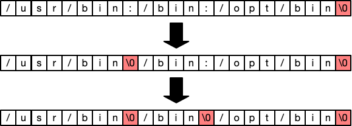
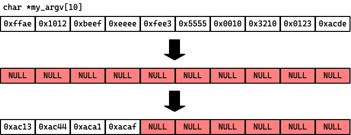

<a name="toc"></a>
<!--ts-->
* [Introduction](#introduction)
   * [Example interaction](#example-interaction)
   * [Collaboration](#collaboration)
* [Assignment Overview](#assignment-overview)
   * [Using make](#using-make)
   * [Overall Tips](#overall-tips)
* [Requirements](#requirements)
* [Phases](#phases)
   * [Phase 1: Parsing the PATH](#phase-1-parsing-the-path)
      * [Hints and Tips](#hints-and-tips)
   * [Phase 2: Implementing the command loop with exit](#phase-2-implementing-the-command-loop-with-exit)
      * [Hints and Tips](#hints-and-tips-1)
   * [Phase 3: Implementing cd and hard-coding pwd](#phase-3-implementing-cd-and-hard-coding-pwd)
      * [Hints and Tips](#hints-and-tips-2)
   * [Phase 4: Running relative path programs](#phase-4-running-relative-path-programs)
      * [Hints and Tips](#hints-and-tips-3)
   * [Phase 5: Finding programs using the PATH](#phase-5-finding-programs-using-the-path)
      * [Hints and Tips](#hints-and-tips-4)
   * [Phase 6: Implementing history and !n](#phase-6-implementing-history-and-n)
      * [Hints and Tips](#hints-and-tips-5)
   * [Phase 7: Great Job!](#phase-7-great-job)
* [Congratulations!](#congratulations)

<!-- Created by https://github.com/ekalinin/github-markdown-toc -->
<!-- Added by: langm, at: Tue Dec 20 22:59:08 UTC 2022 -->

<!--te-->

# Introduction

For this lab, you will create a shell in C.

Like bash (the default shell on Lily), Z Shell (default shell on OSX), and the
Windows shell (Windows), your shell will interpret user commands and perform
delegation to the operating system on behalf of the user.

Your shell will provide the basic functionality necessary for a user to interact
with a Linux system. Advanced features like pipeline processing, command
aliasing, builtin commands, scripting, etc. are not in scope.

It will essentially run a loop:

1. Prompts the user for an input command.
2. Parse the input line in order to determine whether to run another program or
   perform a built-in action.
3. Either perform the built-in, or
4. Fork itself and, in the child process, execute a program.
5. Wait for the program or action to exit.
6. Repeat.

The objectives for this lab are the following:

* Become familiar with and use string processing functions in the C library.
* Understand and manipulate pointers to data.
* Practice C syntax and semantics.
* Learn to debug a nontrivial C program.

## Example interaction

[Here's](/doc/sample_interaction.md) what your shell should be able to do by the
end of the lab. Note that I run the program from my bash shell first, and then
all interactions are with my shell.

## Collaboration

It is fine to collaborate for this project. However, all code that you turn in
must be your own. You may not copy code directly from others or from the
internet. Copying code and renaming variables _is copying code._

You can and should talk about general problems in the lab, how to use specific
functions, etc.

__When you make your PR, note who you worked with and on what
phases/sections/functions/etc.__ If you do __not__ do this but you do work with
others, I will find it extremely suspicious if your code is similar...

🔝 [back to top](#toc)

# Assignment Overview

Begin by cloning this GitHub respository on Lily. Make sure that the first thing
that you do is __create a new branch!__

```
$ git clone <your-repo-url>
$ cd <your-repo>
$ git checkout -b <your-branch-name>
$ git status
$ ls
```

The structure of the lab is as follows:

```
lab1
|-- doc                     -- images/references in this file
|-- README.md               -- this file
`-- src          
    |-- argument_test.c     -- test program for part 4
    |-- cwd.c               -- library function for part 2 
    |-- cwd.h               -- library function for part 2
    |-- environment_test.c  -- test program for part 4
    |-- lab1.c              -- main source code file
    `-- Makefile            -- make rule definitions
```

The source code for the lab is in the `src` directory.

You can tackle this lab any way you want, but it is split up into 7 stages, and
it is recommended that you implement the lab by following those stages in
sequence.

## Using `make`

Since typing long commands to compile and link programs can be tedious and
error-prone, we will be using a build system for this lab.
[Make](https://en.wikipedia.org/wiki/Make_(software)) is one of the first and
most widespread [build systems](https://en.wikipedia.org/wiki/Build_automation)
used for Unix-like systems.

Large software projects involve millions of lines of source code spread across
thousands of source files. The Linux kernel, for example, is tens of millions of
code and the source code is on the order of GBs in size.

Managing dependencies between modules, external dependencies, build rules,
multi-platform builds, etc. is an enourmous task itself. Therefore we automate
it using software. 

For the labs in this class we'll be using Make, which automates this process.
Our projects will not be nearly as large as Linux, but nevertheless will benefit
from using a build tool. You can read more about Make and find a tutorial aimed
at undergraduates
[here](https://www.cs.swarthmore.edu/~newhall/unixhelp/howto_makefiles.html).

For this lab, all that you need to know is that there are four __build
targets__ defined in the Makefile, and these targets define how to build
specific things in the project.

* `my_shell` -- this is the default target. It builds your shell by compiling
  `lab1.c` and its dependencies (in this case `cwd.{c,h}`). To build the lab,
  first __make sure you are in the `src` directory__ and then run:

  ```
  $ make
  ```
  
  __or__

  ```
  $ make my_shell
  ```

  Both are equivalent. When you run these, you will notice that an executable
  file name `my_shell` has been built. Object files (`lab1.o` and `cwd.o`) are
  also built as intermediate steps.

  To run the lab, run:

  ```
  $ ./my_shell
  ```

* `environment_test` -- this is a test program that you will run in part 4. To
  build and run the environment test:

  ```
  $ make environment_test
  $ ./environment_test
  ```

* `argument_test` -- this is a test program that you will run in part 4. To
  build and run the argument test:

  ```
  $ make argument_test
  $ ./argument_test
  ```

* `clean` -- this will clean up all non-source files (executables and
  intermediate files). You can run this to clean up the source directory.

  ```
  $ make clean
  ```

## Overall Tips

* You will be required to use a bunch of different functions from the C standard
  library. You should use the [system
  manual](https://en.wikipedia.org/wiki/Man_page) to read their documentation.

  * Use the command `man 3 <function-name>` to read the manual for a function.

  * You can also search the manual using `man -f`. For example, `man -f
    string.h` shows you that there is a manual page for the string library.
    Since the result of `man -f` tells us that it is in section 7, we can use
    `man 7 string.h` to view the man page for that function.

* Read [Chapter
  2.9.5](https://diveintosystems.org/book/C2-C_depth/advanced_libraries.html) on
  C libraries.

* Use `printf` and also use `assert` when you want to make sure that assumptions
  hold. You should also use
  [gdb](https://www.cs.swarthmore.edu/~newhall/unixhelp/howto_gdb.php) for more
  in-depth debugging. Just remember to clean up your code by removing extraneous
  print statements when you are done.

  > "The most effective debugging tool is still careful thought, coupled with
  > judiciously placed print statements."
  >
  > — Brian Kernighan, "Unix for Beginners" (1979)

* Breaking your program into functions--especially for the history manipulation
  section--will be helpful.

* Keep pointers and data pointed to separate in your mind. It is always helpful
  to draw diagrams of memory!

* Always assume that you can fix the maximum size of things. You should not need
  to use `malloc` or `free` __at all__ in this program.

* Use constant names rather than their values. There are helpful constants
  already defined for you in the handout.

* Do not be afraid to ask for help! Ask general questions in the Slack channel!
  This can include questions like "what does this compiler error mean" (omit
  your code, though!), "what do you mean by XXX", etc. It is fine to anonymously
  ask for help. It is fine to say a specific place where you are stuck, as long
  as you do not share your specific code!

🔝 [back to top](#toc)

# Requirements

Your shell should allow users to:

* Run programs, including programs that take command line arguments.
* Allow a user to use `cd` to navigate the filesystem structure.
* Keep a history of commands and allow the user to view their command history
  and optionally re-execute previously-executed commands.

🔝 [back to top](#toc)

# Phases

Here, the lab is broken down by intermediate goals. Even if you do not end up
following this outline, you should read through the sections, as they contain
details about how your shell should behave under certain circumstances and tips
on implementing particular behaviors.

## Phase 1: Parsing the `PATH`

Unix systems use environment variables to store configuration data. These
variables are globally-available and can be used for system-wide configuration
or for specific program configuration. Environment variables are essentially 
a global map from strings to strings, where the key is the name of the variable,
and the value is the variable's value.

You can use the bash shell's `$` syntax to read environment variables. Try the
following:

```
$ echo $HOME 
$ echo $USER
$ echo $HOSTNAME
$ echo $HOSTTYPE
$ echo $PATH
```

The last one--the `PATH` environment variable--is one that we will be paying
special attention to in this lab. The `PATH` variable keeps track of where your
shell looks to find executable programs.

Trying `echo`ing your `PATH` and then running `ls` to list the files in some of
the directories that are listed:

```
$ ls /bin
$ ls /usr/bin
```

This is where many of the system-wide programs are stored! Aside: You can use the
`which` command to tell you where a specific program is stored (e.g., `$ which
python`).

You can see that the `PATH` variable is a colon-separated list of paths. The
order that they are listed is the order that they are searched for programs to
run.

My path, for example, looks like this:

```
$ echo $PATH
/home/langm/bin:/opt/hpc/bin:/usr/local/Modules/bin:/usr/local/sbin:/usr/local/bin:/usr/sbin:/usr/bin:/sbin:/bin:/usr/games:/usr/local/games:/snap/bin:/usr/local/go/bin
```

Yours probably looks similar.

Part 1 of this lab is to get the `PATH` variable from the environment of your
shell program and to print its contents.

At the end of this section, you should be able to run your program and see
something like this:

```
$ ./my_shell
Welcome to MyShell!
Path:   /home/langm/bin
        /opt/hpc/bin
        /usr/local/Modules/bin
        /usr/local/sbin
        /usr/local/bin
        /usr/sbin
        /usr/bin
        /sbin
        /bin
        /usr/games
        /usr/local/games
        /snap/bin
        /usr/local/go/bin
```

### Hints and Tips

* Use the function `getenv` to return a pointer to the `PATH` variable.

  * Note that this function returns a pointer to the actual variable value! If
    you modify the pointed-to value, it modifies the environment variable for your
    program.

  * If you are going to manipulate it, we should first copy its contents to
    another string that we declare. You can use the `strncpy` function to copy a
    string.

  * Remember to use the manual pages to read function documentation!

* You will need to split the string on the colon. Unlike Python or Java, which
  allow you to split a string into an array of substrings, C's `strtok` function
  __operates on the string it is parsing__. When you split a string using
  `strtok`, you modify the underlying string itself. Here, for example, is that
  the memory for a string looks like after it has been parsed with `strtok`
  (i.e., `strtok` has been called enough times to fully parse the string):

  

* I recommend using an array of string pointers to keep track of the paths.
  The type an array of string pointers is `char *var_name[array_size]`.
  [This](http://www.ericgiguere.com/articles/reading-c-declarations.html) is a
  good reference for parsing C types.

* For anything that seems dynamic in this lab (length of commands, number of
  paths, size of history, etc.) you can just assume that there is a maximum
  size. For example, you can assume that there are at most 512 paths, at most
  512 chars in a command, at most 50 elements in history, etc. See the example
  `#define` constants.

* Use `git` to keep track of versions! Once you have something working, make a
  commit to checkpoint where you are! You can always `git push` to make sure
  that GitHub has an up-to-date copy of your code. Do __not__ make a pull
  request until the end of the lab though!

🔝 [back to top](#toc)

## Phase 2: Implementing the command loop with `exit`

Now, you will implement your first shell command and the command loop.

Write a loop that displays a prompt (`$`) and reads a string input (remember
that you can assume a maximum command length) and then parses the input. The
_only_ parsing you need to do for this step is check whether the command equals
"exit" -- if so, your shell can exit.

When you are done, you should have a shell that can do something like this:

```
langm@lily:~/251/labs/lab1/src$ ./my_shell
Welcome to MyShell!
Path:   /home/langm/bin
        /opt/hpc/bin
        /usr/local/Modules/bin
        /usr/local/sbin
        /usr/local/bin
        /usr/sbin
        /usr/bin
        /sbin
        /bin
        /usr/games
        /usr/local/games
        /snap/bin
        /usr/local/go/bin
$
no command specified
$
no command specified
$
no command specified
$
no command specified
$ exit
langm@lily:~/251/labs/lab1/src$
```

### Hints and Tips

* Use `strncmp` to check for string equality.

* To read a line, use `fgets` to read a line of user input.

  > Note that `fgets` __includes__ the newline character in the line of input
  > that it reads. You will need to account for this in your code. The
  > easiest/cleanest thing to do is to remove that newline character (or any
  > trailing whitespace -- see the man page for `isspace`).

* Remember to `git commit` to checkpoint your work when you're done!

🔝 [back to top](#toc)

## Phase 3: Implementing `cd` and hard-coding `pwd`

Now you will implement two built-in commands: `cd` and `pwd`.

`pwd` should print the current directory. You can use the distributed `cwd()`
function to get the current directory as a string.

For `cd`, you will need to use the `chdir` function to change the shell's
current working directory. 

Make sure you handle the error cases!

Here's an example interaction that can be done when this section is complete:

```
langm@lily:~/251/labs/lab1/src$ ./my_shell
Welcome to MyShell!
Path:   /home/langm/bin
        /opt/hpc/bin
        /usr/local/Modules/bin
        /usr/local/sbin
        /usr/local/bin
        /usr/sbin
        /usr/bin
        /sbin
        /bin
        /usr/games
        /usr/local/games
        /snap/bin
        /usr/local/go/bin
$ cd ..
$ pwd
/home/langm/251/labs/lab1
$ cd src
$ pwd
/home/langm/251/labs/lab1/src
$ cd /home
$ pwd
/home
$ cd foobar
cd: No such file or directory
$ cd langm/251/labs/lab1
$ pwd
/home/langm/251/labs/lab1
$ exit
```

### Hints and Tips

* You can use `strtok` like you did before to split the input into substrings.

* `chdir` can return an error! You can use the built-in function `perror` to
  display the error message after a function that sets `errno` returns an error. 

  * `errno` is a global variable in the C library that is used to store the
    error code of some functions. Notice that in the `chdir` manual page, it
    mentions: "On error, -1 is returned and errno is set appropriately."

  * Read the manual page for `perror` to get a message describing the last error
    encountered.

🔝 [back to top](#toc)

## Phase 4: Running relative path programs

Now we are finally at the place where we can start running programs!

In this section, you will write the code that creates a new process. We will
focus only on programs run using relative paths (i.e., starting with `./` and
located in a subdirectory) for right now.

This section has a few requirements and can be further subdivided:

* Parsing relative commands (i.e., finding commands that start with `./`).
* Parsing command line arguments (i.e., splitting the command string into
  arguments).
* Executing a program with a relative path.
* Passing command line arguments to a program.
* Passing the environment to a program.

```
langm@lily:~/251/labs/lab1/src$ make argument_test
gcc -g -Wall -Werror   -c -o argument_test.o argument_test.c
gcc -g -o argument_test argument_test.o
langm@lily:~/251/labs/lab1/src$ make environment_test
gcc -g -Wall -Werror   -c -o environment_test.o environment_test.c
gcc -g -o environment_test environment_test.o
langm@lily:~/251/labs/lab1/src$ ./my_shell
Welcome to MyShell!
Path:   /home/langm/bin
        /opt/hpc/bin
        /usr/local/Modules/bin
        /usr/local/sbin
        /usr/local/bin
        /usr/sbin
        /usr/bin
        /sbin
        /bin
        /usr/games
        /usr/local/games
        /snap/bin
        /usr/local/go/bin
$ ./argument_test
Got 1 arguments:
        ./argument_test
$ ./argument_test hello this is a larger number of command line arguments
Got 11 arguments:
        ./argument_test
        hello
        this
        is
        a
        larger
        number
        of
        command
        line
        arguments
$ ./environment_test
OK 12 /home/langm/bin:/opt/hpc/bin:/usr/local/Modules/bin:/usr/local/sbin:/usr/local/bin:/usr/sbin:/usr/bin:/sbin:/bin:/usr/games:/usr/local/games:/snap/bin:/usr/local/go/bin
```

__Important! For background, please read
[Chapter 13.2](https://diveintosystems.org/book/C13-OS/processes.html) in Dive Into
Systems__. Also read [Chapter
2.9.2](https://diveintosystems.org/book/C2-C_depth/advanced_cmd_line_args.html)
on command line arguments.

First, let's look at how the arguments to `main` are populated. If you examine
`argument_test.c`, you can see that the code is rather simple: it prints out the
values of `argc` (an integer) and `argv` (an array of strings). `argc` is the
number of arguments a program is given, and `argv` is their contents. Every
program has at least one argument (the name of the executable file), but can be
supplied with more. Let's look at a couple of examples. Run the following:

```
$ make argument_test
$ ./argument_test
$ ./argument_test here are a few parameters
```

You can see that even when run with no additional arguments, `argc` is 1 and
`argv` has some contents.

When you run a program from your shell, you need to populate the `argv` of the
program being executed. In order to do this, we need to parse the command line
into strings separated by spaces.

Then, when we run a program, we will use the OS-provided functions `exec` and
`fork`. Skim the documentation for `exec` and `fork` in the provided manual
page:

```
$ man 3 fork
$ man 3 exec
$ man 3 wait
```

You can see that `exec` replaces a running program with a new one, and `fork`
creates a copy of a running program. We will talk a lot of about processes soon,
but for right now, you can have the mental model of program = process.

The general process for starting _any_ program in a Unix-like system is the
following:

1. `fork` the currently-running program, creating a child process running the same
   code.
2. Replace the child process with a new program using `exec`.

Note that `fork` returns 0 to the child process and the process id of the child
to the parent. Using `fork` almost always looks like this:

```
pid_t pid = fork();
if (pid == -1) {
  // handle error
  perror("fork");
} else if (pid == 0) {
  // this is the child process...
  // exec another program, or do child tasks...
} else {
  // this is the parent process...
  // do parent tasks, or...
  wait(NULL); // wait for a child to finish.
}
```

Note that in our shell, we want to wait for the program that we spawn to
complete, so we will call `wait` to wait for the program to finish running.

You may notice that there are many variations of `exec`. __Use the `execve`
variant to pass argv and the environment to the new process.__

### Hints and Tips

* Use `environ` to pass the environment to the child. `man 3 environ` for
  details about this global variable. You need to declare it as `extern` to use
  it.

* Use `strtok` to parse the command line. Notice that the format for `argv` that
  is passed to `execve` is an array of pointers to strings. We need to populate
  this with pointers to the command line parameters the user supplies. `argv` is
  supposed to be a null-terminated array of pointers. 

  In order to null-terminate the array, it may be helpful to first just set the
  contents of the array to 0/`NULL`, and then only populate the initial elements.

  When variables are first allocated, their contents is whatever is in memory
  (which are likely junk values). So, we can set the value of every element in
  the array to 0/`NULL` and only populate the values that are real. To clear the
  array, use `memset` (`man 3 memset`).

  

* Use the test programs to validate that your shell properly passes command line
  arguments _and_ properly sets the environment. `argument_test.c` 
  shows you program arguments. `environment_test.c` validates that the `PATH` is
  set in the child process (and contains more than one path--this will fail if
  you modify the original path variable when using `strtok` to parse the path).

* Properly handle errors from `execve` and `fork` by using `perror`.

* If a program does not exist, you can either handle this case yourself or just
  delegate to `execve` and have it set `errno`.

* Remember that strings are arrays and you can index into them!

🔝 [back to top](#toc)

## Phase 5: Finding programs using the `PATH`

Now we can finally execute arbitrary programs!

For this part, you should:

* Read the command. If it is not relative,
* Look for it in all of the directories of the `PATH`.
* If found (and the file is executable), run it!

```
langm@lily:~/251/labs/lab1/src$ ./my_shell
Welcome to MyShell!
Path:   /home/langm/bin
        /opt/hpc/bin
        /usr/local/Modules/bin
        /usr/local/sbin
        /usr/local/bin
        /usr/sbin
        /usr/bin
        /sbin
        /bin
        /usr/games
        /usr/local/games
        /snap/bin
        /usr/local/go/bin
$ echo this is a test
this is a test
$ cat Makefile
CFLAGS=-g -Wall -Werror
CC=gcc

my_shell: lab1.o cwd.o
        $(CC) -g -o $@ $^

environment_test: environment_test.o
        $(CC) -g -o $@ $^

argument_test: argument_test.o
        $(CC) -g -o $@ $^

clean:
        rm -f *.o environment_test my_shell
$ vim lab1.c
$ exit
```

### Hints and Tips

* Scan the directories in the `PATH` for a program to execute in a loop.

  * In each iteration, use `strncpy` and `strncat` to build a full path to a
    file. (e.g., if a path element is `/usr/bin` and the command is `vim`, build
    the string `/usr/bin/vim`).

  * Check if the program is executable (`X_OK`) by using the `access` function.

* Make sure that you set `argv[0]` to the appropriate value (i.e., the full path
  to the program) for the child process!

* If the program doesn't exist in any path, print an appropriate error message
  (or just delegate to `execve` and have it set `errno`).

🔝 [back to top](#toc)

## Phase 6: Implementing `history` and `!n`

In this phase, you will keep a command history and provide users with the
ability to view and execute commands from history.

Split this phase into two parts:

1. Keeping and printing a history.
2. Executing commands from history.

After this section, you should be able to perform the full interaction listed
at the start of the lab!

To keep a history, used a fixed size circular buffer of strings (use an array of
arrays). Circular buffers are fixed size data structures that you can add/remove
elements from. Since history is not editable, your buffer will only grow. When
it is full, just overwrite the oldest commands.

The [Wikipedia page](https://en.wikipedia.org/wiki/Circular_buffer) for circular
buffers describes how to implement one.

When the user enters the command `history`, you should display the history of
commands.

When a user enters `!n` (where `n` is any number), the command numbered n should
be executed.

### Hints and Tips

* Keep a copy of commands in history. If you do this, you should be able to
  reuse all of your existing code to parse the command!

* Ring buffers can be difficult to get right. Start with a small number of
  history elements when you are debugging, so that you can test cases where the
  buffer isn't quite full, and cases where the buffer's size is exceeded.

* Since you aren't removing elements from the history, your buffer
  implementation can be simpler than keeping start and end pointers.

* There are a variety of functions to parse numbers. Simple ones are `atoi`,
  `strtol`, or `sscanf`.

🔝 [back to top](#toc)

## Phase 7: Great Job!

Give yourself a pat on the back, you just built a nontrivial piece of system
software! Woohoo!


# Congratulations!

You are done! Push your branch, make a PR and set me as a reviewer. Remember to
give credit to those that you worked with.

🔝 [back to top](#toc)

